# 📊 UML & System Diagrams — Inventory Management System

> A comprehensive reference of all UML and system architecture diagrams for the multi-tenant Inventory Management System built with React, Express.js, and MongoDB.

---

## 📋 Table of Contents

1. [System Architecture Diagram](#1-system-architecture-diagram)
2. [Class Diagram (Data Models)](#2-class-diagram-data-models)
3. [Entity-Relationship (ER) Diagram](#3-entity-relationship-er-diagram)
4. [Use Case Diagram](#4-use-case-diagram)
5. [Sequence Diagram — User Authentication](#5-sequence-diagram--user-authentication)
6. [Sequence Diagram — Sale Transaction](#6-sequence-diagram--sale-transaction)
7. [Sequence Diagram — Purchase Transaction](#7-sequence-diagram--purchase-transaction)
8. [Activity Diagram — User Signup Flow](#8-activity-diagram--user-signup-flow)
9. [Activity Diagram — Staff Join Store Flow](#9-activity-diagram--staff-join-store-flow)
10. [State Diagram — Product Stock States](#10-state-diagram--product-stock-states)
11. [State Diagram — User Session States](#11-state-diagram--user-session-states)
12. [Component Diagram — Frontend Architecture](#12-component-diagram--frontend-architecture)
13. [Deployment Diagram](#13-deployment-diagram)
14. [API Flow Diagram](#14-api-flow-diagram)
15. [Role-Based Access Control (RBAC) Matrix](#15-role-based-access-control-rbac-matrix)

---

## 1. System Architecture Diagram

High-level overview of the full-stack multi-tenant system.

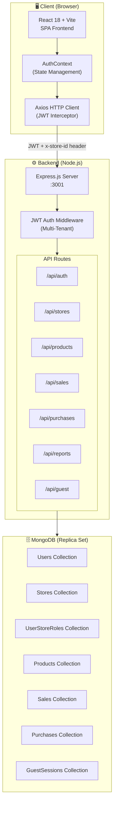

---

## 2. Class Diagram (Data Models)

Represents all Mongoose schema models and their relationships.

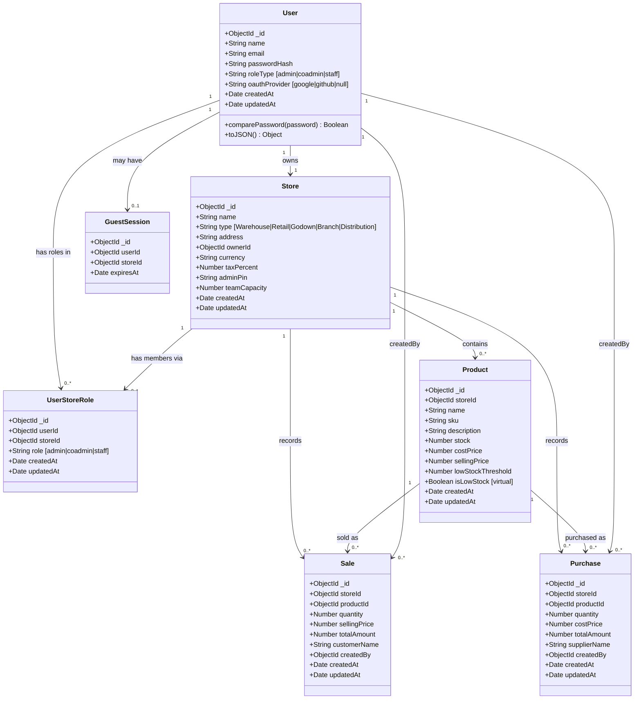

---

## 3. Entity-Relationship (ER) Diagram

Database-level relationships between all collections.

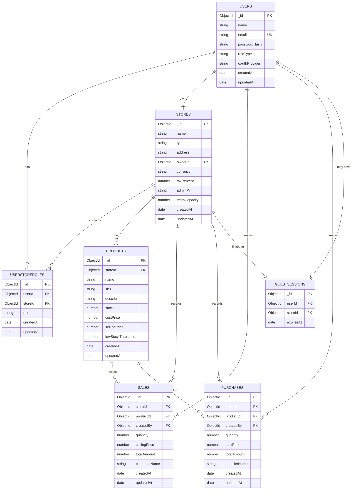

---

## 4. Use Case Diagram

Actors and their permitted interactions with the system.

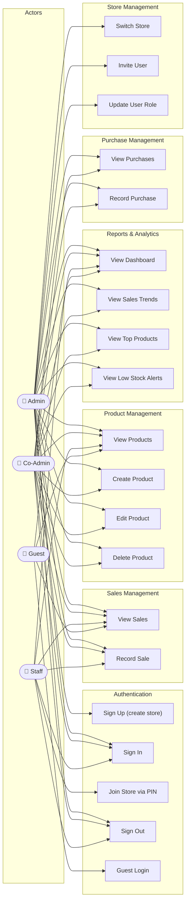

---

## 5. Sequence Diagram — User Authentication

Login and token-based session flow.

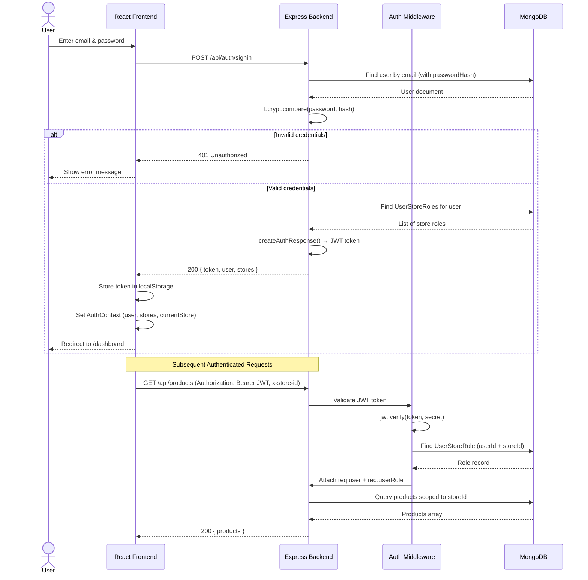

---

## 6. Sequence Diagram — Sale Transaction

Atomic stock update when a sale is recorded.

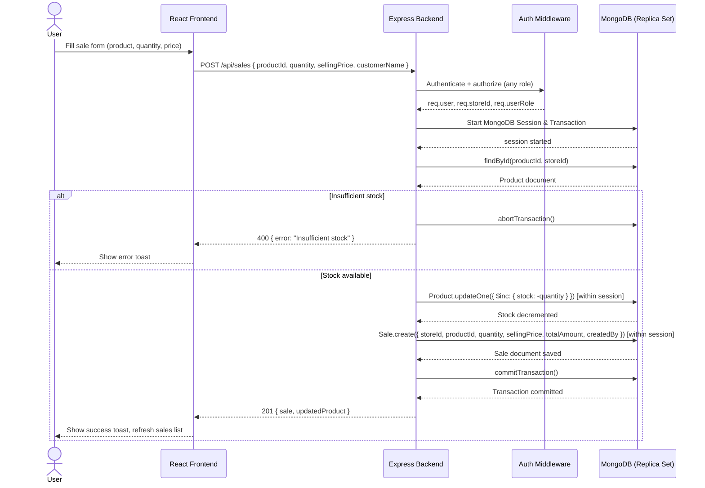

---

## 7. Sequence Diagram — Purchase Transaction

Atomic stock increment when a purchase is recorded.

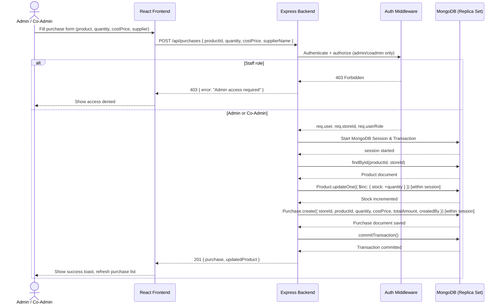

---

## 8. Activity Diagram — User Signup Flow

Complete flow for creating a new admin account and first store.

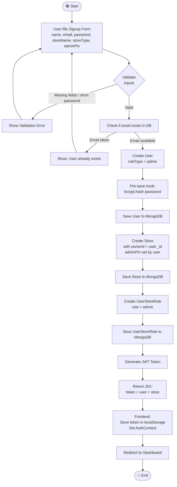

---

## 9. Activity Diagram — Staff Join Store Flow

Flow for Co-Admin/Staff joining an existing store via PIN.

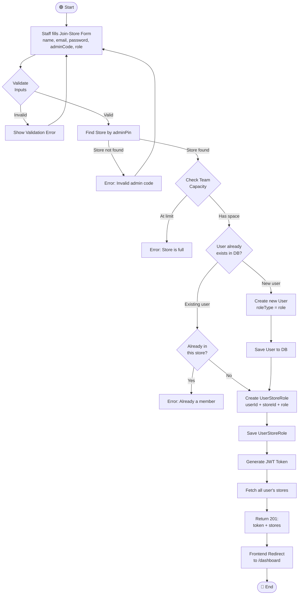

---

## 10. State Diagram — Product Stock States

All possible stock states and transitions for a product.

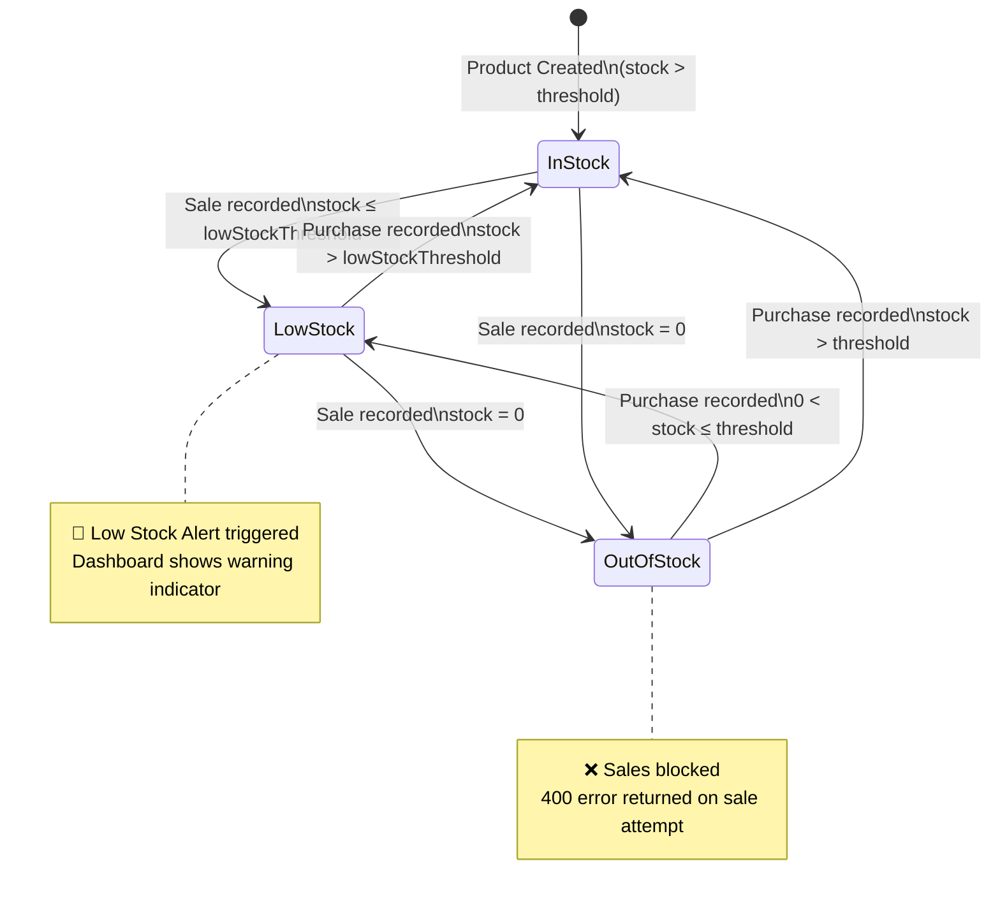

---

## 11. State Diagram — User Session States

Frontend authentication session lifecycle.

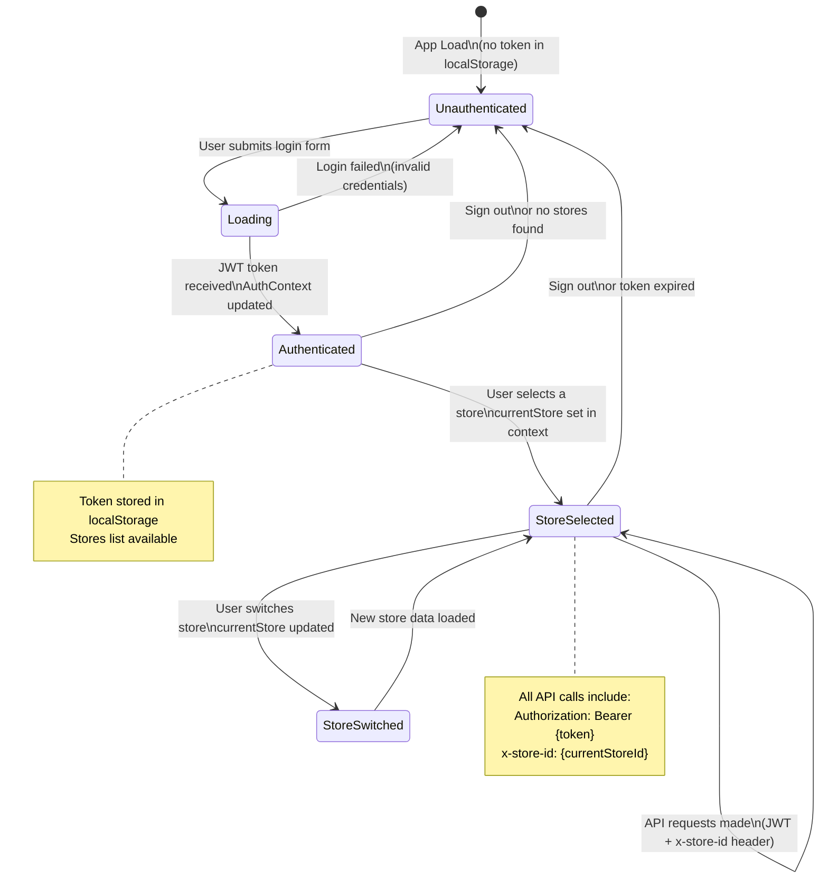

---

## 12. Component Diagram — Frontend Architecture

React component tree and context relationships.

```mermaid
graph TB
    subgraph Entry["Entry Point"]
        Main["main.jsx"]
    end

    subgraph AppLayer["App Layer"]
        App["App.jsx"]
        AuthProvider["AuthProvider\n(AuthContext.jsx)"]
    end

    subgraph Routing["Routing"]
        AppRoutes["AppRoutes"]
        PublicRoute["PublicRoute"]
        ProtectedRoute["ProtectedRoute\n(adminOnly flag)"]
    end

    subgraph Layout["Layout Components"]
        Layout["Layout"]
        GuestBanner["GuestBanner"]
        Navbar["Navbar"]
        Sidebar["Sidebar"]
        BottomNav["BottomNav"]
    end

    subgraph Pages["Pages"]
        Login["Login.jsx"]
        Signup["Signup.jsx"]
        Dashboard["Dashboard.jsx"]
        Products["Products.jsx"]
        Sales["Sales.jsx"]
        Purchases["Purchases.jsx\n(Admin/CoAdmin only)"]
        Reports["Reports.jsx\n(Admin/CoAdmin only)"]
    end

    subgraph SharedComponents["Shared Components"]
        Button["Button.jsx"]
        Card["Card.jsx"]
        Input["Input.jsx"]
        Modal["Modal.jsx"]
        LoadingSpinner["LoadingSpinner.jsx"]
        StoreSwitcher["StoreSwitcher.jsx"]
    end

    subgraph Utils["Utilities"]
        ApiUtil["api.js\n(Axios + JWT Interceptor)"]
        AuthContext["AuthContext\n(user, stores, currentStore)"]
    end

    Main --> App
    App --> AuthProvider
    AuthProvider --> AppRoutes
    AppRoutes --> PublicRoute
    AppRoutes --> ProtectedRoute
    PublicRoute --> Login
    PublicRoute --> Signup
    ProtectedRoute --> Layout
    Layout --> GuestBanner
    Layout --> Navbar
    Layout --> Sidebar
    Layout --> BottomNav
    Layout --> Dashboard
    Layout --> Products
    Layout --> Sales
    Layout --> Purchases
    Layout --> Reports

    Dashboard --> Card
    Dashboard --> LoadingSpinner
    Products --> Modal
    Products --> Button
    Products --> Input
    Sales --> Modal
    Purchases --> Modal

    Navbar --> StoreSwitcher
    Pages --> ApiUtil
    ApiUtil --> AuthContext
```

---

## 13. Deployment Diagram

Physical deployment of all system components.

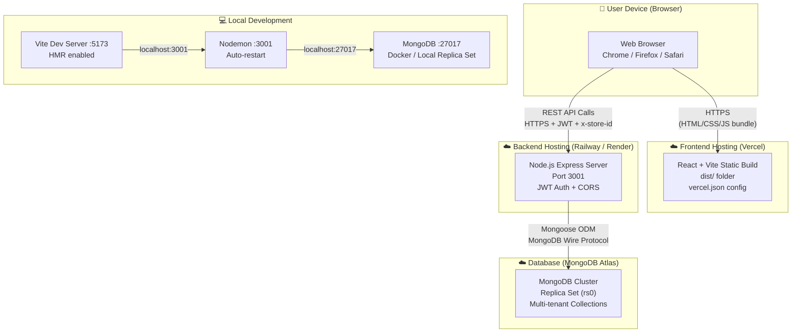

---

## 14. API Flow Diagram

Request lifecycle from frontend to database and back.

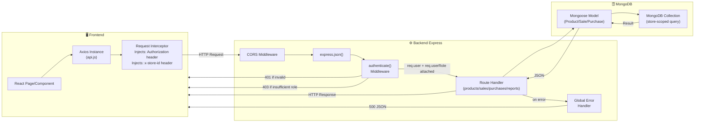

---

## 15. Role-Based Access Control (RBAC) Matrix

Permission matrix for all user roles across features.

| Feature / Endpoint | Admin | Co-Admin | Staff | Guest |
|---|:---:|:---:|:---:|:---:|
| **Authentication** | | | | |
| Sign Up (create store) | ✅ | ❌ | ❌ | ❌ |
| Sign In | ✅ | ✅ | ✅ | ❌ |
| Join Store via PIN | ❌ | ✅ | ✅ | ❌ |
| Guest Login | ❌ | ❌ | ❌ | ✅ |
| **Products** | | | | |
| View Products | ✅ | ✅ | ✅ | ✅ |
| Create Product | ✅ | ✅ | ❌ | ❌ |
| Edit Product | ✅ | ✅ | ❌ | ❌ |
| Delete Product | ✅ | ✅ | ❌ | ❌ |
| **Sales** | | | | |
| View Sales | ✅ | ✅ | ✅ | ✅ |
| Record Sale (atomic) | ✅ | ✅ | ✅ | ❌ |
| **Purchases** | | | | |
| View Purchases | ✅ | ✅ | ❌ | ❌ |
| Record Purchase (atomic) | ✅ | ✅ | ❌ | ❌ |
| **Reports & Analytics** | | | | |
| Dashboard Stats | ✅ | ✅ | ✅ (limited) | ✅ (limited) |
| Sales Trends | ✅ | ✅ | ❌ | ❌ |
| Top Products | ✅ | ✅ | ❌ | ❌ |
| Low Stock Alerts | ✅ | ✅ | ❌ | ❌ |
| **Store Management** | | | | |
| Switch Store | ✅ | ✅ | ✅ | ❌ |
| Create New Store | ✅ | ❌ | ❌ | ❌ |
| Update Store | ✅ | ❌ | ❌ | ❌ |
| Delete Store | ✅ | ❌ | ❌ | ❌ |
| **User Management** | | | | |
| View Store Users | ✅ | ❌ | ❌ | ❌ |
| Invite User | ✅ | ❌ | ❌ | ❌ |
| Update User Role | ✅ | ❌ | ❌ | ❌ |

---

## 📝 Notes

- **Multi-Tenancy**: All data queries are automatically scoped by `storeId`. The `x-store-id` request header is validated by the `authenticate` middleware on every protected route.
- **Atomic Transactions**: Sales and Purchases use MongoDB replica set transactions to ensure data integrity — if either the stock update or the record creation fails, both are rolled back.
- **JWT Strategy**: Tokens are stateless; sign-out is handled client-side by removing the token from `localStorage`. No server-side session store is used.
- **Low Stock**: The `isLowStock` field is a Mongoose virtual (computed at query time) based on `stock <= lowStockThreshold`. It does not persist in MongoDB.

---

*Generated for: Inventory Management System | Stack: React + Express.js + MongoDB*
